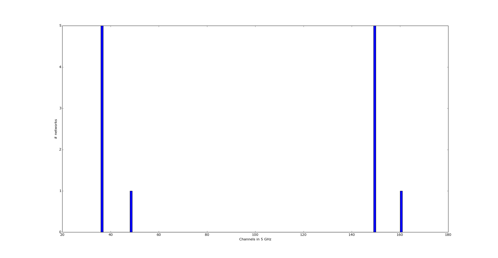

#channel_graph
------------
This repository is created to observe histogram of active 
networks in Wi-Fi band. Script is written in **_python_**.   

Usage:
```
python channel_graph.py <frequency>
```

Examples:
```
python channel_graph.py 2GHz
python channel_graph.py 5GHz
```
In order to observe networks in detail, I used **_iwlist wlan0 scan_** command with 
Python's **_subprocess_** library. Then, parsed this information via **_grep_** command and remained
script in channel_graph.py  

```
cmd = 'iwlist wlan0 scan | grep -w "(Channel"'
proc = subprocess.Popen([cmd], stdout=subprocess.PIPE, shell=True)
```
Consequently, I used **__pyplot__** framework to plot histogram, 
which uses same syntax with **__MATLAB__**.

##Screenshot 


  
